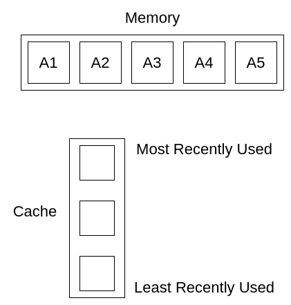
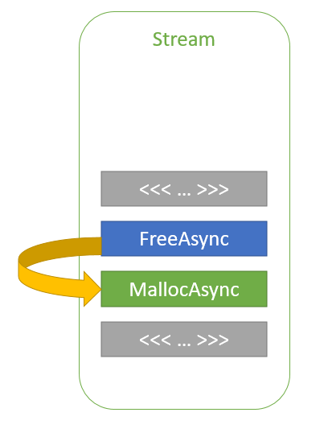

# Experiments

## Setup

We attempt our experiments on the following hardware and software setup:

- **Hardware**: NVIDIA GeForce RTX 3060 (12GB)
- **Software**: Ubuntu 20.04, Python 3.8.10

We compare our TensorLib library with PyTorch 2.2.0.

## Iris Dataset - Experiment 1

The Iris dataset is a popular dataset in machine learning. It contains 150 samples of iris flowers, each with four features. We attempt to classify the iris flowers into three classes. Used a two layer MLP network with hidden size of 5 and cross entropy loss.

### Results

The loss and accuracy of the model on the test set are as follows:

As we can see, our library has similar final loss and accuracy as PyTorch. There is a slight difference in the learning curve, for instance, the initial loss is higher in our library (which we will explain later).

For the training time:

Our GPU time is very similar to Torch, and Torch’s CPU time is slower than ours, which indicates that there are some overheads with Torch code (will talk about later). However, the dataset too small to be representative.

## MNIST Dataset - Experiment 2

MNIST dataset is a dataset of handwritten digits. It contains 60,000 training images and 10,000 testing images. For both runs we did preprocess by normalizing the images and flattening them using sklearn.

For the architecture, we use a two layer MLP network with hidden size of 128 and cross entropy loss.

### Results

Looking at the training time, we can see that Torch's training time is significantly longer, which indicates that there is something wrong.

This is why we decided to do some profiling to see where the bottleneck is. The tools we used were:

- 'flamegraph' for CPU profiling and stack trace, which uses linux perf under the hood.
- 'NVIDIA Nsight Systems' for GPU profiling, which traces GPU kernel launches and memory transfers.

Looking at the `nsys` results for pytorch, we can see that there are a lot of memory copying, as indicated by the `cudaMemcpyAsync` calls, as well as the `CatArrayBatchedCopy` function.

Looking at the flamegraph results, we see a similar trend:

Zooming in:

We can see that the execution time is dominated by the `PyIter_Next` function, which uses the majority of its time in `THPVariable_NewWithVar` (THP stands for Torch Python). Which reminded us of the common issues with the PyTorch dataloader, since it often avoids optimizing for better compatibility (see this [example tweet](https://x.com/cloneofsimo/status/1855608988681080910)).

Testing different PyTorch dataloader configurations:

we can see that most dataloader configurations have significant overhead. The configuration with more workers require transferring the data to CPU, which is why it is slower. Also, using GPU pinning is also slightly slower. In the end, the best configuration is one that we wrote custom, which essentially just passes a reference to the data instead of copying it each time. We are allowed to do this because we know that, in our use case, the data will not be modified.

Looking at the new nsys and flamegraph results, we can see that the overhead is significantly reduced:

The nsys indicates that now, most of the time is spent on `cudaMemcpyAsync` and `ampere_segemm_64x32_sliced1x4_nt` functions, which are the actual computation functions. The flamegraph also indicates that the `PyIter_Next` function is no longer the bottleneck, and many of the other functions are now more balanced.

Looking at the new training times:

We can see that the training time for our library is now slower than Torch, which is as expected. Now, in an attempt to optimize our library, we look at the nsight and flamegraph results for our library:

We can see that out code has significantly more `cudaMalloc` and `cudaFree` calls, which is expected since we are not reusing memory as much as Torch. This is why we wanted to implement a memory pool, which is a pre-allocated memory that we can reuse. And the memory is freed/reused similar to a Least Recently Used (LRU) cache.

However, we discovered that cuda already has a memory pool called [stream ordered memory allocator (SOMA)](https://developer.nvidia.com/blog/using-cuda-stream-ordered-memory-allocator-part-1/) which is a memory pool that is used to allocate memory in streams. Streams are a way to organize work on the GPU, and they are used to overlap computation and memory copy. Streams support asynchronous memory copy and memory allocation/deallocation (`cudaMallocAsync` and `cudaFreeAsync`). 

By setting the `cudaMemPool_t` to a higher threshold, the stream will enable unused memory to be persisted in the pool and reused later. 

After implementing SOMA in our library, we can see that the memory allocation and deallocation calls are significantly reduced:

Now it is dominated by device synchronization calls, which we have after each kernel launch. However, this is not necessary, since the device only needs to be synchronized when we need to copy data back to the host. We can remove these synchronization calls:

Looking at the final training times, we can see that implementing SOMA has significantly reduced the training time, and further removing the synchronization calls has reduced it even more:

Our implementation is very close to Torch's. However, profiling the memory usage, we can see that Torch uses significantly less memory than our library. This might be due to the fact that Torch uses a more optimized memory pool.

Looking at the training curve, we can see that our starting loss is higher than Torch's, and this time it did not converge to the same loss as Torch:

This is due to the initialization of the weights. In our library, we initialize the weights using a standard normal distribution. Testing out initilization using Kaiming and Xavier initialization, we can see that the loss is now lower than torch's:

## Conclusion

In conclusion, we have shown that our library is able to achieve similar performance to PyTorch, with some optimizations. We have also shown that the memory usage of our library is higher than PyTorch, which can be optimized in the future.

In the future, we plan to implement kernel fusion, which is a technique that combines multiple operations into a single kernel. This will reduce the number of intermediate tensors and improve performance. For example, the broadcasted addition currently generates an intermediate tensor, which can be avoided by fusing the addition and broadcast operations.